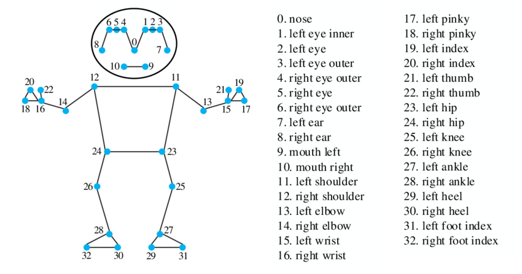

# Pose Tracking and Depth Analysis

This project captures and analyzes human pose data using the RealSense camera and MediaPipe Pose. It provides the following features:
- Tracks and records 3D coordinates of pose landmarks (deprojected data in meters).
- Captures and stores 2D pixel coordinates and depth data (raw depth data in `.npz` format).
- Saves the color video stream for visual reference.
- Organizes data into separate directories with unique test names provided by the user.



## Installation

### Prerequisites

Ensure you are runnign a Debian based or Ubunty (20.4) system and have Python 3.x installed and the following required libraries:

1. [OpenCV](https://pypi.org/project/opencv-python/) for image processing:
    ```bash
    pip install opencv-python
    ```

2. [MediaPipe](https://google.github.io/mediapipe/solutions/pose.html) for pose detection:
    ```bash
    pip install mediapipe
    ```

3. [Intel RealSense SDK](https://github.com/IntelRealSense/librealsense) for camera interfacing:
    - Follow the official guide to install the Intel RealSense SDK on your operating system.

4. [NumPy](https://pypi.org/project/numpy/) for numerical computing:
    ```bash
    pip install numpy
    ```

5. [Human Pose Model](https://developers.google.com/mediapipe/solutions/vision/pose_landmarker):
    - Download the pose landmark model file (e.g., `pose_landmarker.task`).

6. Ensure you have write permissions in the working directory.

### Code Execution

1. Save the Python script to a file, for example, `pose_tracking.py`.

2. Place the downloaded image file (`Human-body-pose-landmark.png`) in the same directory as the script.

3. Run the script using the following command:
    ```bash
    python pose_tracking.py
    ```

### Using the Program

1. **Test Naming**: Upon starting the program, you'll be prompted to enter a test name. This will create a new directory to store output data.

2. **Operation**:
    - The RealSense camera will start recording data.
    - A live preview window displays the tracked pose landmarks.

3. **Data Output**:
    - **Deprojected Data**: `pose_tracking_data_deprojected.csv` (3D coordinates in meters).
    - **Pixel Coordinates and Depth**: `pose_tracking_data_pixel.csv`.
    - **Raw Video Stream**: `color_video.avi`.
    - **Depth Data**: `depth_data.npz` (with timestamps).

4. **Stopping the Program**:
    - Press the `Q` key in the preview window to safely exit and stop data recording.

### Visualization Tool (vis.py)

The visualization tool allows you to replay the previously captured video with pose landmarks overlaid. This is useful for reviewing data after collection.

#### Usage:

1. Save the visualization code to a file named `vis.py`.
2. Place `vis.py` in the same directory as your test folders.
3. Run `vis.py` and enter the directory name for the test data you wish to visualize.
4. Press the `Q` key in the preview window to exit.


### Troubleshooting

- Ensure the RealSense camera is connected and recognized by the system.
- Update the Intel RealSense SDK if data streams are unavailable.
